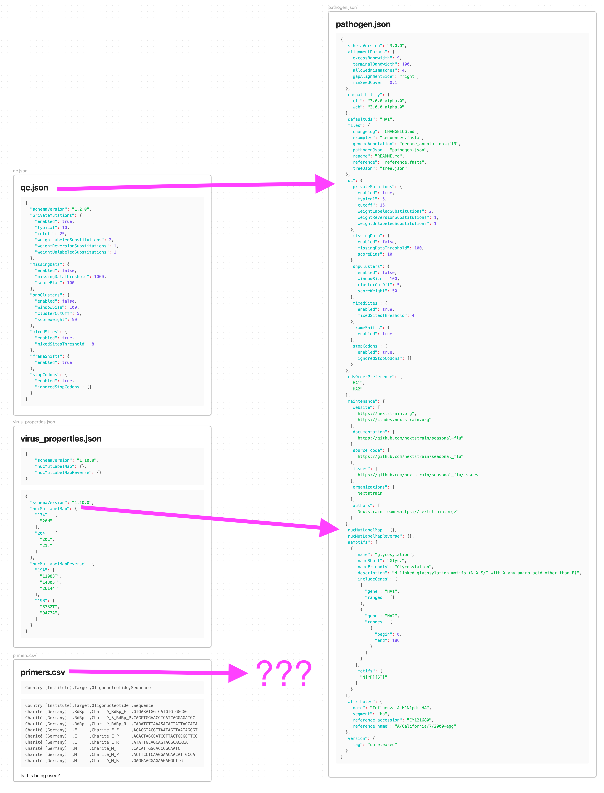

# test_convert_v3

Test conversion of to v3

```bash
git clone https://github.com/nextstrain/nextclade_data.git 
cd nextclade_data/scripts
python convert_v2_to_v3.py \
  --input-dir ~/github/mazeller/NextClade_Datasets/prrsv_yimim_2023 \
  --output-dir prrsv_v3
```

Some errors related to writing a change log:

```bash
Traceback (most recent call last):
  File "/Users/jchang3/github/nextstrain/nextclade_data/scripts/convert_v2_to_v3.py", line 189, in <module>
    convert_dataset_v2_to_v3(
  File "/Users/jchang3/github/nextstrain/nextclade_data/scripts/convert_v2_to_v3.py", line 173, in convert_dataset_v2_to_v3
    process_pathogen_json(tag_json, input_dir, output_dir)
  File "/Users/jchang3/github/nextstrain/nextclade_data/scripts/convert_v2_to_v3.py", line 67, in process_pathogen_json
    attr_table = format_dataset_attributes_md_table(attributes)
  File "/Users/jchang3/github/nextstrain/nextclade_data/scripts/lib/changelog.py", line 45, in format_dataset_attributes_md_table
    value = attr_val["value"]
TypeError: string indices must be integers
```

Modify the `convert_v2_to_v3.py` to drop out the changelog sections

```python
  if not isfile(readme_path):
    #attr_table = format_dataset_attributes_md_table(attributes)       #<===========Comment this out!

    name = tag_json['nameFriendly'] if tag_json['nameFriendly'] != "UNKNOWN" else tag_json['name']
    ref = tag_json["reference"]["strainName"] if tag_json["reference"]["strainName"] != "UNKNOWN" \
      else tag_json["reference"]["accession"] if tag_json["reference"]["accession"] != "UNKNOWN" \
      else ""

    if len(ref) != 0:
      ref = f" based on reference \"{ref}\""

    file_write(
      f"# Nextclade dataset for \"{name}\"{ref} ({input_dir})\n\n\n## Dataset attributes\n\n"
      #f"{attr_table}\n\n## Authors and contacts\n\nSource code: \n\nAuthor1: \n\nAuthor2: \n\n## What is " #<==Comment this out!
      f"Nextclade dataset\n\nRead more about Nextclade datasets in Nextclade documentation: "
      f"https://docs.nextstrain.org/projects/nextclade/en/stable/user/datasets.html",
      readme_path
    )
```

Rerun

```bash
git clone https://github.com/nextstrain/nextclade_data.git 
cd nextclade_data/scripts
python convert_v2_to_v3.py \
  --input-dir ~/github/mazeller/NextClade_Datasets/prrsv_yimim_2023 \
  --output-dir prrsv_v3
```

## Summary of json changes




